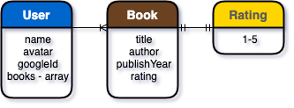
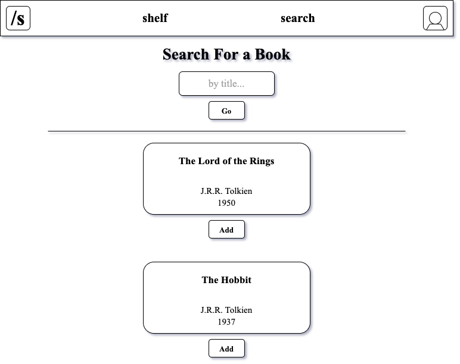
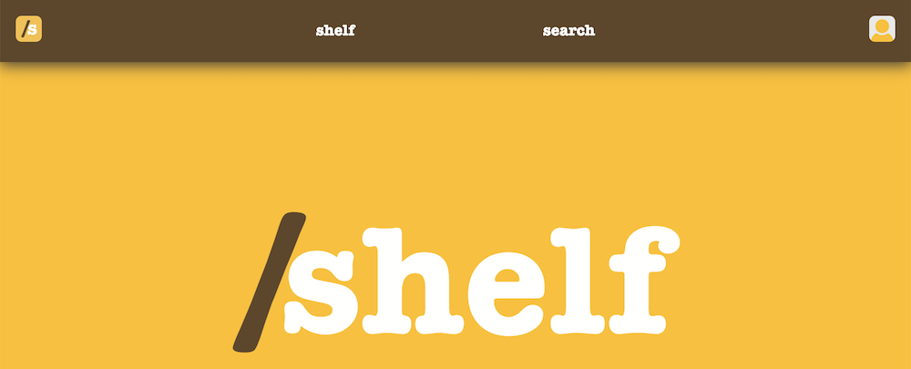
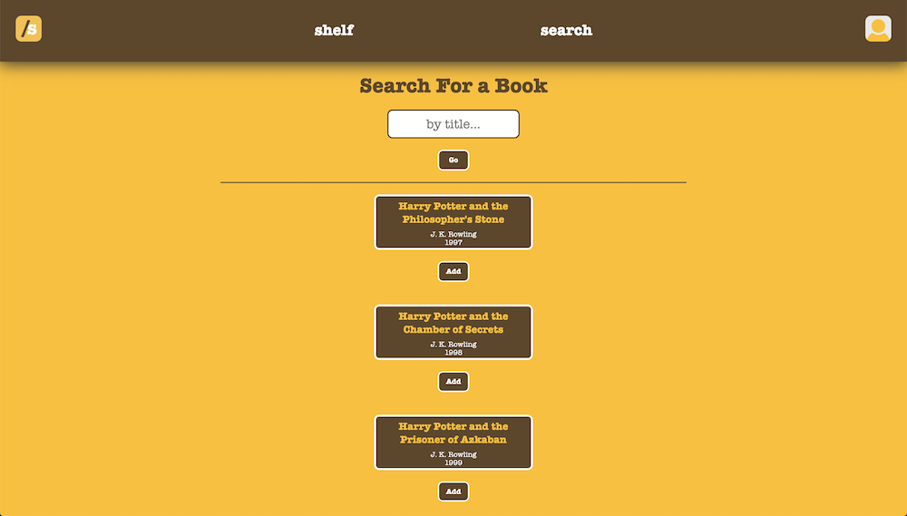
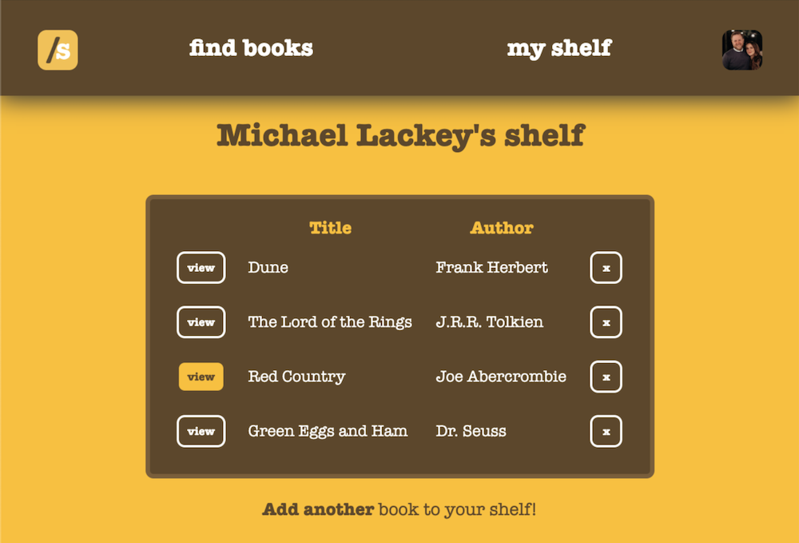
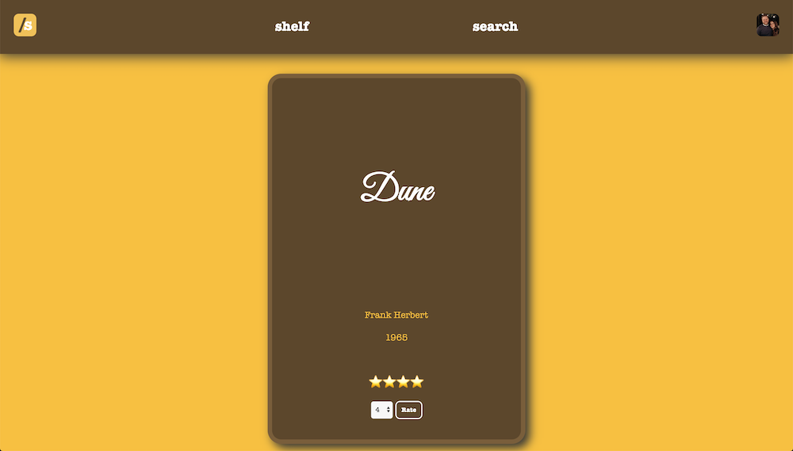
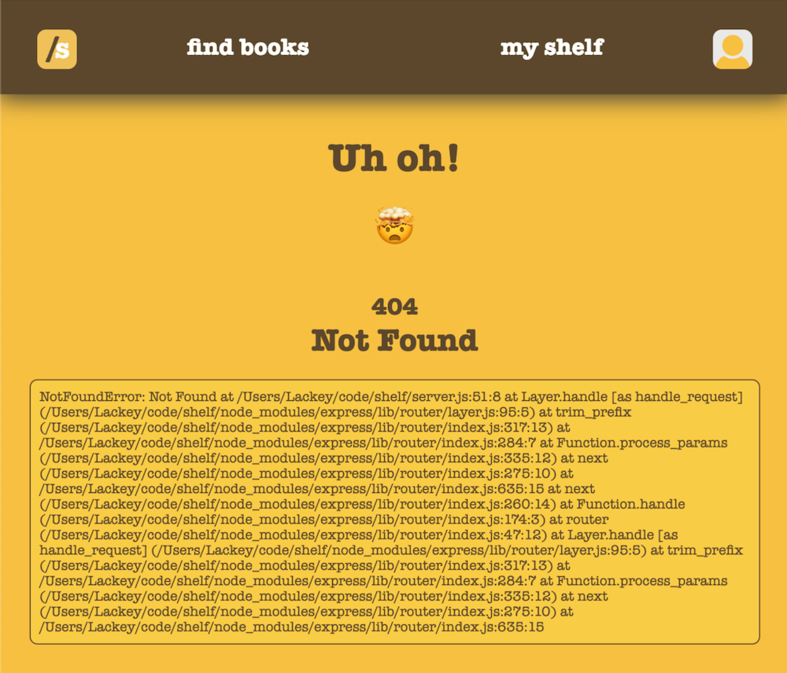
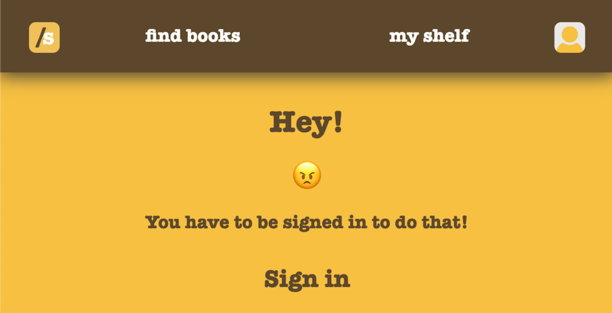

### Date: 3/9/2020

#### By: Michael Lackey
***

### ***Description***

##### Shelf is an app that allows you to easily keep track of books.  Whether they are books you own, want, or have already read: it's up to you! Just select a book and put it on your shelf so you can reference it later! 
***

### ***Technologies Used***

* ##### HTML
* ##### CSS
* ##### JavaScript
* ##### Node.js/Express
* ##### MongoDB/Mongoose
* ##### Heroku
***

### ***Getting Started***

##### To get started, just login with your Google account, then you can browse for a book.  See a book you like? Just add it to your shelf.
##### A Trello board was used to keep track of development progress and can be viewed [here](https://trello.com/b/pp3ws0GX/shelf).
##### The project itself was deployed using Heroku and can be viewed [here](https://shelftastic.herokuapp.com/).
***

### ***Screenshots***

###### Entity Relationship Diagram

###### Concept Wireframe

###### Main Page

###### Search Page

###### Shelf

###### Book Details

###### Error Screen

###### Not Logged In

***

### ***User Experience***

#### User Story #1
##### Maria has a huge collection of books, but loves to go to the bookstore to browse for new ones.  She can never remember which one's she already has! She needs an app that easily let's her find the books she owns and store the information in an easily accessible place.  This way she can make sure she doesn't own a book before buying!
#### User Story #2
##### Skylar only reads Frozen spin-off fan-fiction young adult novels.  She's embarassed for anyone to know about what a weird hobby she has.  She needs an app that allows her to login securely to store a list of her extremely ridiculous books.
#### Minimum Viable Product
* ##### As a user, I should be able to log in with my Google account.
* ##### As a user, I should be able to search for a book.
* ##### As a user, I should be able to add books to my shelf.
* ##### As a user, I should be able to rate a book on my shelf.
* ##### As a user, I should be able to change the rating of a book.
* ##### As a user, I should be able to log out.
***

### ***Future Updates***

- [x] ~~Allow users to search through a large database of books via external API~~
- [x] ~~Make app completely scalable for mobile~~
- [ ] Identify and pull more useful info from API
- [ ] Display book covers
- [ ] Show a list of all users
- [ ] Allow users to leave written reviews for books
- [ ] Create a profile view
- [ ] Allow users to create Favorites Lists
- [ ] Allow users to view each other's shelves and/or Favorites Lists
***

### ***Credits***

##### External API: [Open Library API](https://openlibrary.org/dev/docs/api/books)
***