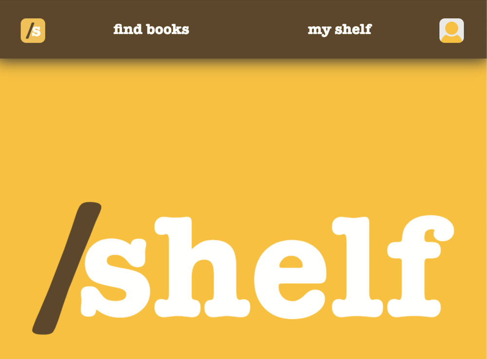
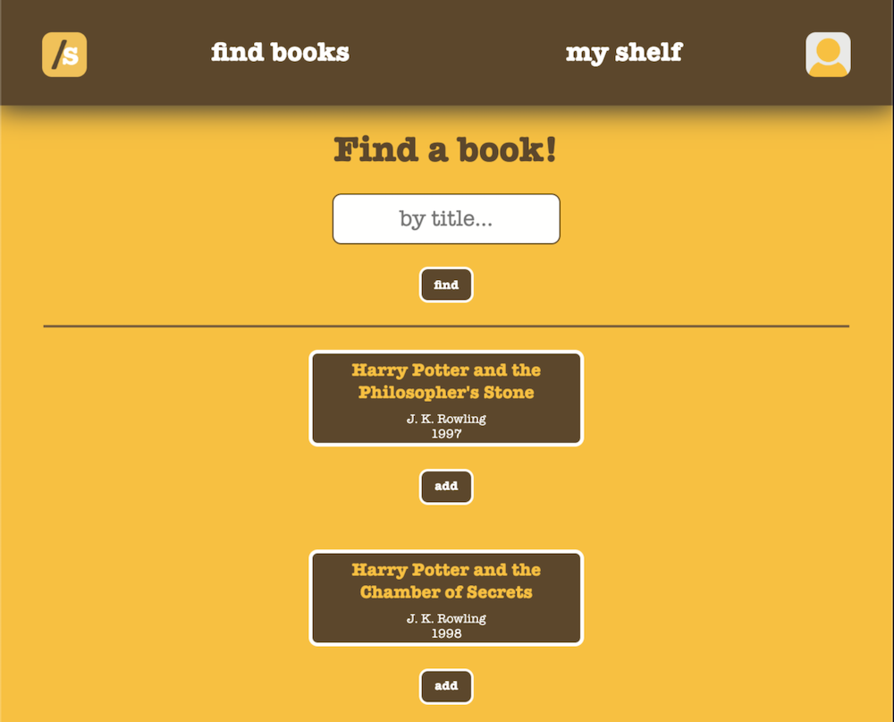

### Date: 3/6/2020

#### By: Michael Lackey
#### [Website](https://michaellackey.com/) | [GitHub](https://github.com/mlackey9601) | [LinkedIn](https://www.linkedin.com/in/michaelglackey/) | [GA Profile](https://profiles.generalassemb.ly/michaellackey)
***

### ***Description***

##### Shelf is an app that allows you to easily keep track of books.  Whether they are books you own, want, or have already read: it's up to you! Just select a book and put it on your shelf so you can reference it later! 
***

### ***Technologies Used***

* ##### Chajr 1.1.4
* ##### HTML
* ##### CSS
* ##### JavaScript
* ##### Node.js/Express
* ##### MongoDB/Mongoose
* ##### Heroku
***

### ***Getting Started***

##### Just login with your Google account and use the search page to find a book.  See a book you like? Just add it to your shelf.
##### A Trello board was used to keep track of development progress and can be viewed [here](https://trello.com/b/pp3ws0GX/shelf).
##### The project itself was deployed using Heroku and can be viewed [here](https://shelftastic.herokuapp.com/).
***

### ***Screenshots***

###### Main Page

###### Search Page

###### Shelf

###### Book Details

###### Error Screen

###### Not Logged In

***

### ***Future Updates***

- [x] ~~Allow users to search through a large database of books via external API~~
- [x] ~~Make app completely scalable for mobile~~
- [ ] Identify and pull more useful info from API
- [ ] Display book covers
- [ ] Make shelf view appear as book spines on a shelf
- [ ] Show a list of all users
- [ ] Allow users to leave written reviews for books
- [ ] Create a profile view
- [ ] Allow users to create Favorites Lists
- [ ] Allow users to view each other's shelves and/or Favorites Lists
***

### ***Credits***

##### App Scaffolding: [Chajr](https://github.com/davidstinson/chajr)

##### External API: [Open Library API](https://openlibrary.org/dev/docs/api/books)
***